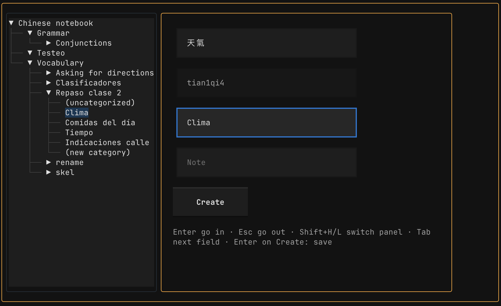
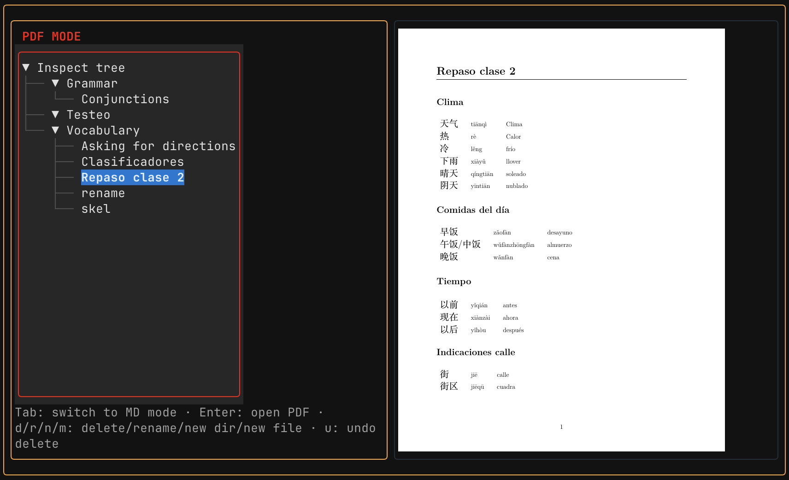

# Vimdiomas

Store vocabulary efficiently into markdown files, tastefully compiled to PDF.

## Tutorial and overview






Only Vim keybindings!


## Installing

Vimdiomas runs on **macOS** and **Linux**. Before you start, have the tools listed under [Dependencies](#dependencies) below, at least Python 3.14+ and git. The first-run wizard checks the rest.

```sh
# Download
git clone https://github.com/Nicostalman/Vimdiomas.git ~/.local/share/vimdiomas

# Setup
cd ~/.local/share/vimdiomas
python3 -m venv .venv
.venv/bin/pip install .

# Run once
~/.local/share/vimdiomas/.venv/bin/vimdiomas
```

From now on the app can be called by its name

```sh
vimdiomas
```

### The wizard

The first time you start Vimdiomas, it walks you through setting up. It runs **once** — once it has written your settings, starting Vimdiomas goes straight to your notebook.

Your settings are saved to `~/.config/vimdiomas/config.toml`.

**If the wizard says `~/.local/bin` isn't on your PATH**, open a new terminal after finishing the wizard — that's what picks up the line it just added — and `vimdiomas` will work. If it still doesn't, the line to add by hand is:

```sh
export PATH="$HOME/.local/bin:$PATH"
```


### Uninstalling

Delete the clone and the command. Your notebook and your settings are separate, and survive:

```sh
rm -rf ~/.local/share/vimdiomas
rm ~/.local/bin/vimdiomas
```

Your notes live wherever you pointed the wizard (`~/Documents/Vimdiomas` by default) and your settings in `~/.config/vimdiomas/`. Delete those too if you really mean it.
